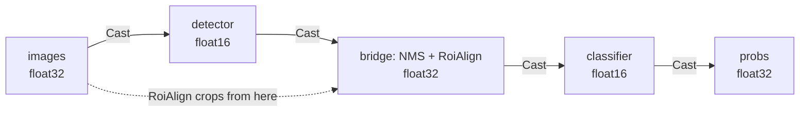

# Half precision (FP16)

An Ultralytics `half=True` export is **half the file**: 5.11 MB against 10.11 MB
for a detector, 10.41 MB against 20.78 MB for a classifier. In a browser, that
decides whether the page opens at all.

This guide shows how to use those files in both SDKs — and what the SDK does
underneath, because the interesting part is where precision **cannot** be half.

## Exporting

```python
from ultralytics import YOLO

YOLO("yolo11n.pt").export(format="onnx", imgsz=640, half=True, opset=19)
YOLO("yolo11s-cls.pt").export(format="onnx", imgsz=224, half=True, opset=19)
```

The resulting `.onnx` declares its input as `tensor(float16)`. That declaration
is what the SDK reads.

## Python: nothing changes

```python
from ort_vision_sdk import Detector

det = Detector("yolo11n_fp16.onnx", labels="coco")
result = det.predict("photo.jpg")[0]

for d in result:
    print(d.name, d.conf, d.box.xyxy)
```

The same code as always. What changed underneath:

```python
from ort_vision_sdk import Detector

det = Detector("yolo11n_fp16.onnx")
print(det.session.input_dtype)  # tensor(float16)
print(det.input_dtype)          # float16  (the NumPy dtype of the feed)
```

!!! info "Why preprocessing stays in float32"
    `(value / 255 - mean) / std` in half precision loses exactly the small
    differences normalization exists to preserve. The SDK preprocesses in
    `float32` and converts **once**, at the feed boundary, against the type each
    input declares.

## Web: the same, with one browser requirement

```typescript
import { Detector } from "@mauriciobenjamin700/ort-vision-sdk-web";

const det = await Detector.create("/models/yolo11n_fp16.onnx");
const result = (await det.predict("/images/photo.jpg"))[0];

for (const d of result) console.log(d.className, d.confidence, d.bbox.asXyxy());
```

ONNX Runtime requires a **native** `Float16Array` for a half tensor — the same
bits in a `Uint16Array` are rejected. Where the browser has no such constructor,
the model is refused at `create()`:

```text
ModelLoadError: This model declares half-precision input(s) [images], but this
environment has no Float16Array, which ONNX Runtime requires for a float16
tensor. Use a float32 export of the model, or run in a browser that supports
Float16Array.
```

!!! tip "Check before you offer the smaller download"
    ```typescript
    import { hasFloat16Array } from "@mauriciobenjamin700/ort-vision-sdk-web";

    const model = hasFloat16Array() ? "/models/det_fp16.onnx" : "/models/det.onnx";
    ```

!!! warning "`session.inputMetadata` cannot answer this"
    On `onnxruntime-web` 1.20.1 it is `undefined`. The declared type is read out
    of the `.onnx` file itself, in the same pass that already reads the class
    names — same download, no extra request.

## Fused pipelines: float16 at the ends, float32 in the middle

Fusing two FP16 stages does **not** produce an all-half graph, and that is not a
preference:

!!! danger "ONNX's `NonMaxSuppression` exists only in float32"
    The operator is defined for `T = tensor(float)`. There is no float16
    variant. An all-half bridge cannot be built.

So the fusion casts at the **seams**, and only there:



```python
from ort_vision_sdk.compose import fuse_detect_classify

fuse_detect_classify(
    detector_onnx="det_fp16.onnx",
    classifier_onnx="clf_fp16.onnx",
    output_path="fused_fp16.onnx",
    image_size=640,
    crop_size=224,
    max_detections=1,
)
```

The fused graph's public input stays `float32`, which is what every preprocessing
pipeline produces — and it is where `RoiAlign` crops from, keeping the geometry
in single precision.

!!! check "What you can verify in the artifact"
    ```python
    import onnx

    fused = onnx.load("fused_fp16.onnx")
    print([n.name for n in fused.graph.node if n.op_type == "Cast"][:4])
    # ['ovs_bind_input', 'ovs_cast_detector_output', 'ovs_cast_crops', 'ovs_bind_probs']
    ```

## What half precision costs

Outputs are widened back to `float32` before any decoding, and there is a
measured reason:

| Coordinate | Spacing in float16 |
| --- | --- |
| 320 px | 0.25 px |
| 640 px | 0.5 px |
| 1280 px | 1.0 px |
| 2048 px | 2.0 px |

In float16, `640.3` **is** `640.5`. Decoding boxes in that type would quantise
every coordinate ahead of NMS and the scale-back to original-image coordinates —
which is why the SDK widens at the boundary, and why you never see half
precision inside a `BoundingBox`.

!!! note "Where the difference really shows"
    Half-precision **weights** change the activations, and therefore the
    confidences, in the decimals. The predicted class rarely moves; the number
    next to it moves a little. If your threshold is calibrated to the third
    decimal, recalibrate after switching to FP16.

## Recap

- Export with `half=True` and use the file as usual: **no code change** in
  either SDK. 🚀
- The SDK reads the type the graph declares, converts the feed at the boundary,
  and widens the output before decoding.
- In the browser, `Float16Array` is required; without it the model is refused at
  `create()`, with a message saying so.
- In a fused pipeline the stages are float16 and the bridge is float32 —
  `NonMaxSuppression` accepts nothing else.
