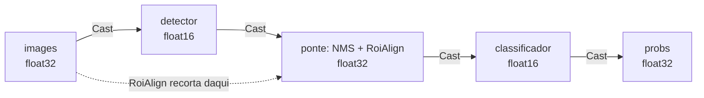

# Meia precisão (FP16)

Um export `half=True` do Ultralytics ocupa **metade** do arquivo: 5,11 MB contra
10,11 MB num detector, 10,41 MB contra 20,78 MB num classificador. Num
navegador, isso decide se a página abre.

Este guia mostra como usar esses arquivos nos dois SDKs — e o que o SDK faz por
baixo, porque a parte interessante é onde a precisão **não** pode ser meia.

## Exportando

```python
from ultralytics import YOLO

YOLO("yolo11n.pt").export(format="onnx", imgsz=640, half=True, opset=19)
YOLO("yolo11s-cls.pt").export(format="onnx", imgsz=224, half=True, opset=19)
```

O `.onnx` resultante declara a entrada como `tensor(float16)`. É essa declaração
que o SDK lê.

## Python: nada muda

```python
from ort_vision_sdk import Detector

det = Detector("yolo11n_fp16.onnx", labels="coco")
result = det.predict("foto.jpg")[0]

for d in result:
    print(d.name, d.conf, d.box.xyxy)
```

Mesmo código de sempre. O que mudou por dentro:

```python
from ort_vision_sdk import Detector

det = Detector("yolo11n_fp16.onnx")
print(det.session.input_dtype)  # tensor(float16)
print(det.input_dtype)          # float16  (o dtype NumPy do feed)
```

!!! info "Por que o pré-processamento continua em float32"
    `(valor / 255 - mean) / std` em meia precisão perde exatamente as pequenas
    diferenças que a normalização existe para preservar. O SDK pré-processa em
    `float32` e converte **uma vez**, na fronteira do feed — contra o tipo que
    cada entrada declara.

## Web: igual, com um requisito de navegador

```typescript
import { Detector } from "@mauriciobenjamin700/ort-vision-sdk-web";

const det = await Detector.create("/models/yolo11n_fp16.onnx");
const result = (await det.predict("/images/foto.jpg"))[0];

for (const d of result) console.log(d.className, d.confidence, d.bbox.asXyxy());
```

O ONNX Runtime exige um `Float16Array` **nativo** para um tensor half — os
mesmos bits num `Uint16Array` são recusados. Onde o navegador não tem esse
construtor, o modelo é recusado já em `create()`:

```text
ModelLoadError: This model declares half-precision input(s) [images], but this
environment has no Float16Array, which ONNX Runtime requires for a float16
tensor. Use a float32 export of the model, or run in a browser that supports
Float16Array.
```

!!! tip "Cheque antes de oferecer o download do modelo menor"
    ```typescript
    import { hasFloat16Array } from "@mauriciobenjamin700/ort-vision-sdk-web";

    const model = hasFloat16Array() ? "/models/det_fp16.onnx" : "/models/det.onnx";
    ```

!!! warning "`session.inputMetadata` não serve para isso"
    No `onnxruntime-web` 1.20.1 ele é `undefined`. O tipo declarado é lido do
    próprio arquivo `.onnx`, no mesmo passe que já lê os nomes de classe — mesmo
    download, nenhuma requisição nova.

## Pipelines fundidos: float16 nas pontas, float32 no meio

Fundir dois estágios FP16 **não** produz um grafo todo em meia precisão, e isso
não é preferência:

!!! danger "O `NonMaxSuppression` do ONNX só existe em float32"
    O operador é definido para `T = tensor(float)`. Não há variante float16. Uma
    ponte inteiramente em meia precisão é impossível de construir.

Então a fusão casta nas **costuras**, e só nelas:



```python
from ort_vision_sdk.compose import fuse_detect_classify

fuse_detect_classify(
    detector_onnx="det_fp16.onnx",
    classifier_onnx="clf_fp16.onnx",
    output_path="fused_fp16.onnx",
    image_size=640,
    crop_size=224,
    max_detections=1,
)
```

A entrada pública do grafo fundido continua `float32`, que é o que todo pipeline
de pré-processamento produz — e é de lá que o `RoiAlign` recorta, mantendo a
geometria em precisão simples.

!!! check "O que dá para conferir no artefato"
    ```python
    import onnx

    fused = onnx.load("fused_fp16.onnx")
    print([n.name for n in fused.graph.node if n.op_type == "Cast"][:4])
    # ['ovs_bind_input', 'ovs_cast_detector_output', 'ovs_cast_crops', 'ovs_bind_probs']
    ```

## O que a meia precisão custa

As saídas voltam para `float32` antes de qualquer decodificação, e há um motivo
medido para isso:

| Coordenada | Espaçamento em float16 |
| --- | --- |
| 320 px | 0,25 px |
| 640 px | 0,5 px |
| 1280 px | 1,0 px |
| 2048 px | 2,0 px |

Em float16, `640.3` **é** `640.5`. Decodificar caixas nesse tipo quantizaria
cada coordenada antes do NMS e do retorno às coordenadas da imagem original —
por isso o SDK alarga a saída na fronteira, e você nunca vê meia precisão numa
`BoundingBox`.

!!! warning "No WASM, FP16 compra bytes — não tempo"
    Não existe kernel de meia precisão no backend WASM: o cast é trabalho a
    mais. Medido num pipeline fundido real (2 baterias × 30 repetições, máquina
    ociosa, medianas reproduzindo entre 0,4 % e 1,1 %):

    | Variante | Mediana | Arquivo |
    | --- | --- | --- |
    | fp32 fundido | 63,2 / 62,7 ms | 30,92 MB |
    | fp16 fundido | 87,5 / 88,2 ms | 15,54 MB |

    **+39 % de latência para 1,99× menos bytes.** Isso inverte a expectativa
    que FP16 cria em servidor. Escolha FP16 no navegador quando o gargalo é
    download/memória, não quando é tempo de inferência. Com WebGPU a pergunta é
    outra — e onde não há adaptador, não há resposta melhor.

!!! note "Onde a diferença aparece de verdade"
    Os **pesos** em meia precisão mudam as ativações, e portanto as confianças,
    nas casas decimais. A classe prevista raramente muda; o número ao lado dela
    muda um pouco. Se o seu limiar está calibrado na terceira casa, recalibre
    depois de trocar para FP16.

## Recap

- Exporte com `half=True`, use o arquivo normalmente: **nenhuma mudança de
  código** nos dois SDKs. 🚀
- O SDK lê o tipo que o grafo declara, converte o feed na fronteira e alarga a
  saída antes de decodificar.
- No navegador, `Float16Array` é obrigatório; sem ele o modelo é recusado em
  `create()`, com mensagem dizendo isso.
- Num pipeline fundido, os estágios ficam em float16 e a ponte em float32 —
  o `NonMaxSuppression` não aceita outra coisa.
