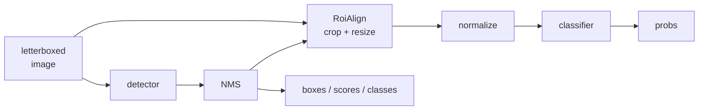

# Fused pipelines (detection → classification)

You have two models. A detector finds the objects; a classifier says which
sub-type each object is. The natural flow is to chain them:

```python
detections = detector.predict("flock.jpg")[0]
for d in detections:
    sub = classifier.predict(d.cropped_image)[0]  # 😐 one more session, one more round trip
```

That works — and it is expensive. It means **two sessions**, **two model
loads**, and a round trip through Python (or JavaScript) for every crop: slice,
resize, restack a batch, call the second runtime. On a phone or in a browser
tab, that round trip is frequently the dominant cost.

The `ort_vision_sdk.compose` module removes both. It rewrites the two `.onnx`
files into a **single graph**: the detector, a bridge that crops and resizes the
boxes, and the classifier. One file, one session, one load — and the crops never
leave the runtime.



!!! info "Fusing is a build step, running is not"
    Fusing needs the `onnx` library (the `[compose]` extra), because it rewrites
    protobufs. What comes out is a plain `.onnx`: **running** it needs nothing
    beyond the `onnxruntime` the SDK already depends on — including in the
    browser, where the web SDK loads the very same file.

## Installing the extra

```bash
pip install "ort-vision-sdk[compose]"
```

## Fusing the two models

```python
from ort_vision_sdk.compose import fuse_detect_classify

fuse_detect_classify(
    "yolov8n.onnx",       # detector: anchor-free YOLO head (v8..v26)
    "resnet18.onnx",      # classifier: one NCHW input, one (batch, classes) output
    "pipeline.onnx",      # where to write the fused model
    max_detections=20,    # how many boxes the pipeline reports per image
    conf_threshold=0.25,  # score threshold, baked into the graph's NMS
    iou_threshold=0.45,   # IoU threshold, same
)
```

That's it. `pipeline.onnx` is a self-contained model.

!!! check "The fusion validates itself"
    Before returning, `fuse_detect_classify` **runs the fused graph once** in
    ONNX Runtime. That is what catches the most common failure — a classifier
    whose graph only accepts the batch size it was exported with (a `Reshape`
    with a hardcoded `1` inside it). You find out at fusion time, not in
    production. Pass `validate=False` to skip it.

## Running it

=== "Python"

    ```python
    from ort_vision_sdk import DetectClassify

    pipeline = DetectClassify("pipeline.onnx")
    result = pipeline.predict("flock.jpg")[0]

    for d in result:
        print(d.name, d.conf, d.box.xyxy)                    # what the detector found
        print(d.classification.name, d.classification.conf)  # what the classifier said
    ```

=== "Web (browser)"

    ```typescript
    import { DetectClassify } from "@mauriciobenjamin700/ort-vision-sdk-web";

    const pipeline = await DetectClassify.create("/models/pipeline.onnx");
    const result = (await pipeline.predict("/images/flock.jpg"))[0];

    for (const d of result) {
      console.log(d.name, d.conf, d.box.xyxy);
      console.log(d.classification?.name, d.classification?.conf);
    }
    ```

You restated **no** configuration when loading. The letterbox resolution, the
crop size, whether the output still needs a softmax, the class names of both
stages — all of it was decided at fusion time and written into the file's own
metadata. It is the same idea as [The model decides](modelo.md), applied to a
whole pipeline.

## Two label spaces, kept apart

A detector that finds `sheep` feeding a classifier that answers `famacha_3`
shares no class ids with it. So the envelope carries **two** maps, and the
classifier's answer lives in its own field:

```python
result.names             # {0: 'sheep', 1: 'goat'}                  — detection stage
result.classifier_names  # {0: 'famacha_1', 1: 'famacha_2', ...}    — classification stage

d = result[0]
d.cls, d.name              # detector class
d.classification.cls       # classifier class — different space, different id
```

!!! warning "Do not compare `d.cls` with `d.classification.cls`"
    They answer different questions: *what kind of object this is* and *which
    sub-category the object belongs to*. Collapsing them into one field would
    lose one of the two answers.

## Choosing where the crops come from

This is the decision that changes the result the most.

=== "`detector_input` (default)"

    Crops from the 640×640 letterboxed tensor itself. The graph has a **single
    input** and is the simplest to operate.

    ```python
    fuse_detect_classify(det, clf, "pipeline.onnx", crop_source="detector_input")
    ```

    The cost: a small object is classified from its downscaled copy. A 40×40 px
    box inside a 640 letterbox becomes a 224×224 crop upsampled from 40×40 pixels
    of real detail.

=== "`original`"

    Adds a second input at native resolution. The bridge undoes the letterbox
    **inside the graph** and crops from the original image.

    ```python
    fuse_detect_classify(det, clf, "pipeline.onnx", crop_source="original")
    ```

    That is two tensors to feed — but the SDK builds both for you, and it is
    still **one session and one load**. Use this when the classifier depends on
    fine detail (texture, mucous-membrane colour, a small lesion).

!!! tip "The boxes are identical in both modes"
    The graph always reports boxes in the detector's letterboxed space, and the
    runtime undoes that transform the same way in both cases. Switching
    `crop_source` changes crop quality, never coordinates.

## How many boxes the pipeline reports

By default the pipeline has a **fixed** number of rows: `max_detections`.
Surplus rows are zero-padded, and the `num_detections` output says how many are
real — the runtime already ignores the rest for you.

```python
fuse_detect_classify(det, clf, "pipeline.onnx", max_detections=20)  # 20 rows, always
```

That is what keeps **every shape in the graph static**, and static shapes are
what TensorRT, NNAPI and WebGPU need in order to compile the model. It is also
what removes the zero-detection case: the classifier always gets `K` crops,
never an empty batch that some execution providers refuse to run.

The price is running the classifier `K` times even when there are 2 objects. If
that outweighs static compilation, use the dynamic mode:

```python
fuse_detect_classify(det, clf, "pipeline.onnx", max_detections=None)
```

??? note "What the dynamic mode requires"
    The classifier must have been exported with a dynamic batch axis, and must
    tolerate a batch of **zero** rows (which is what happens when nothing clears
    the threshold). The fusion's validation run exercises exactly that case, so
    you find out immediately if your model cannot take it.

## Classifier normalization

The crop leaves the graph in `[0, 1]`. The bridge applies your classifier's
normalization right after, with the same parameters the `Classifier` task would
use:

```python
fuse_detect_classify(
    det, clf, "pipeline.onnx",
    mean=(0.485, 0.456, 0.406),  # default: ImageNet
    std=(0.229, 0.224, 0.225),   # default: ImageNet
    input_scale=1.0,             # 255.0 if your model expects 0..255
)
```

Steps that would be no-ops (zero mean, unit deviation, unit scale) are not
emitted as nodes — a classifier that wants the raw `[0, 1]` crop pays for no
arithmetic at all.

## Limits worth knowing

- **The head must be anchor-free YOLO** — output `(1, 4 + nc, N)`, the same
  family [`Detector`](deteccao.md) accepts. Heads with an explicit objectness
  channel (v5/v6/v7) or with built-in NMS (v10 *end2end*) are refused with a
  clear message rather than silently reading the wrong channels.
- **Thresholds are frozen into the graph.** `conf_threshold` and `iou_threshold`
  go inside the NMS node. At runtime you can filter **further**
  (`predict(img, conf_threshold=0.6)`), never looser — to lower the threshold,
  fuse again.
- **The fused NMS scores every class.** The Python decoder collapses each anchor
  to its `argmax` before suppressing; ONNX's `NonMaxSuppression` scores each
  class independently. An anchor that clears the threshold for two classes
  yields two rows here and one row there.
- **Opsets are reconciled upwards.** If the two models were exported at
  different versions, the older one is converted — and the floor is opset 16,
  required by the bridge's `RoiAlign`.

## Recap

- `fuse_detect_classify` turns a detector plus a classifier into **one** `.onnx`.
- Fusing needs the `[compose]` extra; **running needs nothing extra**.
- `DetectClassify` (Python and Web) loads the file and configures itself from
  the metadata written at fusion time.
- `crop_source="original"` costs one extra input and gives the classifier back
  its native resolution.
- A fixed `max_detections` keeps shapes static; `None` trades that for less work
  per run.

## Next steps

- [Detection](deteccao.md) — the head the detection stage must have.
- [Classification](classificacao.md) — the normalization the second stage expects.
- [The model decides](modelo.md) — why configuration lives in the file.
- [Python API](../referencia/python.md) and [Web API](../referencia/web.md).
