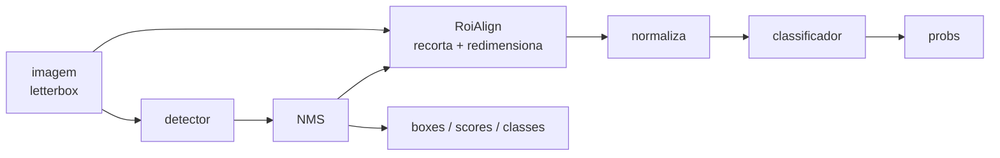

# Pipelines fundidos (detecção → classificação)

Você tem dois modelos. Um detector acha os objetos; um classificador diz de que
subtipo cada objeto é. O fluxo natural é encadear:

```python
detections = detector.predict("rebanho.jpg")[0]
for d in detections:
    sub = classifier.predict(d.cropped_image)[0]  # 😐 uma sessão a mais, uma volta a mais
```

Isso funciona — e custa caro. São **duas sessões**, **dois carregamentos de
modelo**, e uma ida e volta pelo Python (ou pelo JavaScript) para cada recorte:
fatiar, redimensionar, empilhar em batch, chamar o segundo runtime. No celular
ou numa aba de navegador, essa volta costuma dominar o tempo total.

O módulo `ort_vision_sdk.compose` remove as duas coisas. Ele reescreve os dois
`.onnx` num **único grafo**: o detector, uma ponte que recorta e redimensiona as
caixas, e o classificador. Um arquivo, uma sessão, um carregamento — e os
recortes nunca saem do runtime.



!!! info "Fundir é passo de build, rodar não é"
    A fusão precisa da biblioteca `onnx` (o extra `[compose]`), porque ela
    reescreve protobufs. O arquivo resultante é um `.onnx` comum: **rodar** não
    precisa de nada além do `onnxruntime` que o SDK já traz — inclusive no
    navegador, onde o SDK web carrega exatamente o mesmo arquivo.

## Instalando o extra

```bash
pip install "ort-vision-sdk[compose]"
```

## Fundindo os dois modelos

```python
from ort_vision_sdk.compose import fuse_detect_classify

fuse_detect_classify(
    "yolov8n.onnx",       # detector: cabeça YOLO anchor-free (v8..v26)
    "resnet18.onnx",      # classificador: uma entrada NCHW, uma saída (batch, classes)
    "pipeline.onnx",      # onde gravar o modelo fundido
    max_detections=20,    # quantas caixas o pipeline reporta por imagem
    conf_threshold=0.25,  # limiar de score, gravado dentro do NMS do grafo
    iou_threshold=0.45,   # limiar de IoU, idem
)
```

Pronto. `pipeline.onnx` é um modelo autocontido.

!!! check "A fusão se valida sozinha"
    Antes de retornar, `fuse_detect_classify` **roda o grafo fundido uma vez** no
    ONNX Runtime. Isso é o que pega o erro mais comum — um classificador cujo
    grafo só aceita o batch com que foi exportado (um `Reshape` com `1` fixo lá
    dentro). Você descobre na hora de fundir, não em produção. Passe
    `validate=False` para pular.

## Rodando

=== "Python"

    ```python
    from ort_vision_sdk import DetectClassify

    pipeline = DetectClassify("pipeline.onnx")
    result = pipeline.predict("rebanho.jpg")[0]

    for d in result:
        print(d.name, d.conf, d.box.xyxy)          # o que o detector achou
        print(d.classification.name, d.classification.conf)  # o que o classificador disse
    ```

=== "Web (browser)"

    ```typescript
    import { DetectClassify } from "@mauriciobenjamin700/ort-vision-sdk-web";

    const pipeline = await DetectClassify.create("/models/pipeline.onnx");
    const result = (await pipeline.predict("/images/rebanho.jpg"))[0];

    for (const d of result) {
      console.log(d.name, d.conf, d.box.xyxy);
      console.log(d.classification?.name, d.classification?.conf);
    }
    ```

Você não repetiu **nenhuma** configuração ao carregar. Resolução do letterbox,
tamanho do recorte, se a saída ainda precisa de softmax, os nomes das classes
dos dois estágios — tudo isso foi decidido na fusão e gravado nos metadados do
próprio arquivo. É a mesma ideia de [O modelo manda](modelo.md), levada ao
pipeline inteiro.

## Dois espaços de rótulo, separados

Um detector que acha `sheep` alimentando um classificador que responde
`famacha_3` não compartilha id de classe nenhum com ele. Por isso o envelope
carrega **dois** mapas, e a resposta do classificador mora no seu próprio campo:

```python
result.names             # {0: 'sheep', 1: 'goat'}       — estágio de detecção
result.classifier_names  # {0: 'famacha_1', 1: 'famacha_2', ...} — estágio de classificação

d = result[0]
d.cls, d.name              # classe do detector
d.classification.cls       # classe do classificador — outro espaço, outro id
```

!!! warning "Não compare `d.cls` com `d.classification.cls`"
    São perguntas diferentes: *que tipo de objeto é esse* e *de que subcategoria
    esse objeto é*. Juntar os dois num campo só perderia uma das respostas.

## Escolhendo de onde vêm os recortes

Esta é a decisão que mais muda o resultado.

=== "`detector_input` (padrão)"

    Recorta do próprio tensor 640×640 já letterboxado. O grafo tem **uma entrada
    só** e é o mais simples de operar.

    ```python
    fuse_detect_classify(det, clf, "pipeline.onnx", crop_source="detector_input")
    ```

    O custo: um objeto pequeno é classificado a partir da cópia reduzida. Uma
    caixa de 40×40 px dentro do letterbox de 640 vira um recorte de 224×224
    ampliado a partir de 40×40 pixels de detalhe real.

=== "`original`"

    Adiciona uma segunda entrada em resolução nativa. A ponte desfaz o letterbox
    **dentro do grafo** e recorta da imagem original.

    ```python
    fuse_detect_classify(det, clf, "pipeline.onnx", crop_source="original")
    ```

    São dois tensores para alimentar — mas o SDK monta os dois para você, e
    continua sendo **uma sessão e um carregamento**. Use esta opção quando o
    classificador depende de detalhe fino (textura, cor de mucosa, lesão
    pequena).

!!! tip "As caixas são idênticas nos dois modos"
    O grafo sempre reporta as caixas no espaço letterboxado do detector, e o
    runtime desfaz essa transformação do mesmo jeito nos dois casos. Trocar o
    `crop_source` muda a qualidade do recorte, nunca as coordenadas.

## Quantas caixas o pipeline reporta

Por padrão o pipeline tem um número **fixo** de linhas: `max_detections`. Sobras
são preenchidas com zeros, e a saída `num_detections` diz quantas são reais — o
runtime já ignora o resto para você.

```python
fuse_detect_classify(det, clf, "pipeline.onnx", max_detections=20)  # 20 linhas, sempre
```

Isso é o que mantém **todos os shapes do grafo estáticos**, e shapes estáticos
são o que TensorRT, NNAPI e WebGPU precisam para compilar o modelo. É também o
que elimina o caso de zero detecções: o classificador sempre recebe `K`
recortes, nunca um batch vazio que alguns providers se recusam a executar.

O preço é rodar o classificador `K` vezes mesmo quando há 2 objetos. Se isso
pesar mais que a compilação estática, use o modo dinâmico:

```python
fuse_detect_classify(det, clf, "pipeline.onnx", max_detections=None)
```

??? note "O que o modo dinâmico exige"
    O classificador precisa ter sido exportado com eixo de batch dinâmico, e
    precisa tolerar um batch de **zero** linhas (o que acontece quando nada passa
    do limiar). A validação da fusão testa exatamente esse caso, então você
    descobre na hora se o seu modelo não aguenta.

## Normalização do classificador

O recorte sai do grafo em `[0, 1]`. O que tem que acontecer depois disso depende
inteiramente de **como o seu classificador foi treinado** — e as duas famílias
mais comuns discordam:

| Família | Espera | Preset |
| --- | --- | --- |
| torchvision / timm | tensor normalizado com média e desvio do ImageNet | `"imagenet"` |
| Ultralytics (`YOLO(...).export()`) | `[0, 1]` cru, sem normalização nenhuma | `"ultralytics"` |

Por isso o padrão é `normalization="auto"`: a fusão **lê os metadados do
classificador** e escolhe sozinha.

```python
from ort_vision_sdk.compose import fuse_detect_classify

# Nada a decidir: o arquivo diz o que ele é.
fuse_detect_classify(det, "yolo11s-cls.onnx", "pipeline.onnx")
```

Todo export do Ultralytics carrega `author: Ultralytics` e `task: classify` no
próprio `.onnx`. Esse par é determinístico, e o SDK já lia esse bloco para
aproveitar os nomes de classe — então a informação necessária para acertar
sempre esteve dentro do arquivo que você entrega.

!!! danger "O modo de falha que isto elimina"
    Até a 0.8.0 o padrão era ImageNet para todo mundo. Fundir um classificador
    Ultralytics com esse padrão insere um `Sub`/`Div` que o modelo **nunca viu no
    treino** — e nada reclama: não levanta exceção, não emite warning, e
    `validate=True` passa (ele confere forma, não semântica). O grafo roda,
    devolve `probs` com a forma certa e classifica pior. Sem medir concordância
    contra a rota não-fundida, não há como perceber.

### Escolhendo à mão

```python
fuse_detect_classify(det, clf, "pipeline.onnx", normalization="imagenet")
fuse_detect_classify(det, clf, "pipeline.onnx", normalization="ultralytics")
fuse_detect_classify(det, clf, "pipeline.onnx", normalization="none")
```

`"none"` é a mesma aritmética que `"ultralytics"` — identidade — com um nome que
diz "este modelo quer `[0, 1]` cru" em vez de citar um fornecedor.

### Valores próprios

Um modelo cuja normalização nenhum preset descreve recebe os números direto:

```python
fuse_detect_classify(
    det, clf, "pipeline.onnx",
    mean=(0.5, 0.5, 0.5),
    std=(0.5, 0.5, 0.5),
    input_scale=1.0,     # 255.0 se o seu modelo espera 0..255
)
```

!!! tip "`mean` e `std` são independentes"
    Passar só um dos dois deixa o outro no valor do preset que o `auto`
    escolheria — passar um `mean` não zera o desvio para 1 pelas suas costas.

Passar `mean`/`std` **junto** com `normalization` levanta `ValueError`: são duas
respostas para a mesma pergunta, e adivinhar qual delas você quis dizer é como um
grafo acaba normalizado de um jeito e com metadado dizendo outro.

E se o classificador for um export Ultralytics e você pedir uma normalização que
não é identidade, sai um `UserWarning` — o grafo é construído do mesmo jeito, mas
você fica sabendo.

### O que ficou registrado no arquivo

A escolha vai para os metadados do modelo fundido, em
`ovs.classifier_normalization`:

```bash
python -c "import onnx; print({k.key: k.value for k in onnx.load('pipeline.onnx').metadata_props}['ovs.classifier_normalization'])"
# ultralytics
```

Uma vez fundida, a normalização é um punhado de nós `Sub`/`Div` no meio do
grafo — invisível. "Que preprocessamento este pipeline assume?" é a primeira
pergunta quando um modelo fundido classifica pior que a cascata que ele
substituiu, e agora o arquivo responde.

Passos que seriam identidade (`mean` zero, `std` unitário, escala 1.0) não viram
nós — um classificador que quer o recorte cru em `[0, 1]` não paga aritmética
nenhuma.

## Quando não detectar nada é um erro

Um pipeline que não acha nada devolve um envelope vazio — o classificador nem
chega a ter linha para responder. Se o passo seguinte depende de ter alguma
coisa ali, `raise_on_empty` transforma isso em exceção, exatamente como no
[`Detector`](deteccao.md#quando-nao-detectar-nada-e-um-erro):

```python
pipeline = DetectClassify("pipeline.onnx", raise_on_empty=True)
pipeline.predict("pasto-vazio.jpg")   # -> NoDetectionsError
```

O limiar citado na mensagem é o **efetivo**: o maior entre o que foi congelado
no NMS do grafo na fusão e qualquer `conf_threshold` mais estrito passado na
chamada.

## Quando fundir compensa

Fundir **não** é sempre mais rápido. A intuição diz que sim — um artefato, uma
sessão, sem ida e volta pelo host — mas o custo de verdade depende de onde o
tempo está, e num pipeline de detecção ele quase nunca está na ponte.

Estes números vêm de um pipeline real (detecção de mucosa ocular a 640 →
classificação a 224, i9-13900F de 12 núcleos, RTX 4070 Ti SUPER,
onnxruntime 1.24.3), 200 passadas cronometradas com 20 de aquecimento, mediana
de 20 repetições:

| Device | Topologia | Sessões | Latência | vs cascata |
| --- | --- | --- | ---: | ---: |
| CPU | cascata `.onnx`, 6+6 threads | 2 | **33,06 ms** | 1,00× |
| CPU | **fundido** | 1 | **50,65 ms** | **0,65×** |
| CPU | cascata `.pt` (torch) | 2 | 69,45 ms | 0,48× |
| GPU | cascata `.onnx`, 6+6 threads | 2 | **5,97 ms** | 1,00× |
| GPU | **fundido** | 1 | **5,74 ms** | **1,04×** |
| GPU | cascata `.pt` (torch) | 2 | 11,24 ms | 0,53× |

**Na CPU o grafo fundido foi 53 % mais lento** que duas sessões bem
configuradas. Na GPU empatou.

### Por que o teto é baixo

A quebra por estágio da cascata na CPU explica tudo:

| Estágio | ms | % do total |
| --- | ---: | ---: |
| detector | 25,79 | **78,0 %** |
| recorte (`cv2` no host) | 1,49 | **4,5 %** |
| classificador | 5,00 | 15,1 % |

A fusão só pode remover o recorte no host e um repasse entre sessões — **4,5 %
de teto**. E os ~68 nós da ponte (NMS, TopK, Pad, clamp, `RoiAlign`) custam
+17,6 ms na CPU, bem mais que o `cv2.resize` que substituem. Na GPU esses nós
são baratos e o empate reaparece.

!!! info "Capacidade tem preço"
    Uma ponte mínima escrita à mão (`ArgMax` + `RoiAlign`, 22 nós, sem NMS, sem
    padding, um objeto só) marcava 0,99× nessa mesma máquina. A diferença entre
    0,99× e 0,65× é o preço de NMS com limiar, `TopK`, padding para forma
    estática e clamp — justo pelo que compra, mas grande na CPU.

### A armadilha que inverte a conclusão

!!! warning "Cascata mal configurada faz a fusão parecer 5× mais rápida"
    A primeira medição desse estudo deu cascata 148 ms contra fundido 30 ms. O
    número era **falso**: o detector *sozinho* marcava 110 ms dentro da cascata,
    e o grafo fundido contém exatamente o mesmo detector.

    A causa é o ONNX Runtime dar a **cada `InferenceSession` o seu próprio pool
    de intra-op**. Numa cascata os dois estágios se alternam, e o pool que
    acabou de terminar fica em *spin-wait* roubando núcleos do que está rodando:

    | Configuração | Total (CPU) |
    | --- | ---: |
    | 12 + 12 threads | 140,6 ms |
    | 12 + 12, `intra_op.allow_spinning = 0` | 49,4 ms |
    | 6 + 6 threads | 33,7 ms |

    O grafo fundido tem **um** pool e é imune a isso por construção — então
    comparar contra uma cascata mal configurada dá à fusão uma vitória que ela
    não conquistou. A baseline honesta divide o orçamento de threads entre as
    sessões. (`torch` não sofre disso: `torch.set_num_threads` configura um pool
    único para o processo.)

### Reproduzindo a cascata numericamente

Para o grafo fundido reproduzir uma cascata que recorta com `cv2.INTER_LINEAR`:

- **`sampling_ratio=1`** — resample bilinear simples. O default `0` adapta ao
  tamanho da caixa e faz anti-aliasing: melhor em geral, mas amostra diferente
  de um `cv2.resize`.
- **`coordinate_transformation_mode="half_pixel"`** no `RoiAlign`, que é o que a
  ponte já usa: reproduz o `cv2.INTER_LINEAR` com erro absoluto médio de 4·10⁻⁵
  numa imagem em `[0, 1]`, contra 185× mais no `output_half_pixel`.

Com os dois, a concordância de predição entre fundido e cascata ficou em 0,982
(3 divergências em 169 amostras, todas com confiança entre 0,47 e 0,60 — em cima
da fronteira de decisão), delta mediano de probabilidade 3,4·10⁻⁵, e caixa
selecionada idêntica (0,000 px).

### Recomendação

- **Compensa** por portabilidade e operação: um artefato, uma sessão, formas
  estáticas (TensorRT/NNAPI/WebGPU), o mesmo arquivo rodando no SDK web.
- **Não compensa** por latência na CPU, e empata na GPU, quando a alternativa é
  uma cascata com o orçamento de threads dividido.
- **Antes de medir**, olhe a quebra por estágio com
  [`timings`](velocidade.md): se o detector é ~80 % do custo, o teto do ganho da
  fusão é o que sobra.

## Limites que valem saber

- **A cabeça precisa ser YOLO anchor-free** — saída `(1, 4 + nc, N)`, a mesma
  família que o [`Detector`](deteccao.md) aceita. Cabeças com objectness
  explícito (v5/v6/v7) ou com NMS embutido (v10 *end2end*) são recusadas com uma
  mensagem clara em vez de lerem os canais errados em silêncio.
- **Os limiares ficam congelados no grafo.** `conf_threshold` e `iou_threshold`
  vão para dentro do nó de NMS. No runtime você pode filtrar **mais**
  (`predict(img, conf_threshold=0.6)`), nunca menos — para baixar o limiar, funda
  de novo.
- **O NMS fundido pontua todas as classes.** O decodificador Python colapsa cada
  âncora no seu `argmax` antes de suprimir; o `NonMaxSuppression` do ONNX avalia
  cada classe de forma independente. Uma âncora que passa do limiar em duas
  classes vira duas linhas aqui e uma linha lá.
- **Opsets são reconciliados para cima.** Se os dois modelos foram exportados em
  versões diferentes, o mais antigo é convertido — e o piso é o opset 16, exigido
  pelo `RoiAlign` da ponte.
- **`boxes` é a caixa que foi classificada.** Uma caixa que sai do quadro é
  recortada aos limites da imagem antes de virar recorte, e é essa versão
  recortada que sai em `boxes` — desenhar o retângulo e olhar o recorte mostram a
  mesma região. Até a 0.8.0 as duas divergiam: `boxes` reportava a caixa inteira
  e o `RoiAlign` recebia a recortada. Linhas de padding continuam zeradas.

## Recapitulando

- `fuse_detect_classify` transforma detector + classificador em **um** `.onnx`.
- Fundir precisa do extra `[compose]`; **rodar não precisa de nada a mais**.
- `DetectClassify` (Python e Web) carrega o arquivo e se configura sozinho a
  partir dos metadados gravados na fusão.
- `crop_source="original"` custa uma entrada a mais e devolve a resolução nativa
  ao classificador.
- `max_detections` fixo mantém os shapes estáticos; `None` troca isso por menos
  trabalho por execução.

## Próximos passos

- [Detecção](deteccao.md) — a cabeça que o estágio de detecção precisa ter.
- [Classificação](classificacao.md) — a normalização que o segundo estágio espera.
- [O modelo manda](modelo.md) — por que a configuração mora no arquivo.
- [API Python](../referencia/python.md) e [API Web](../referencia/web.md).
