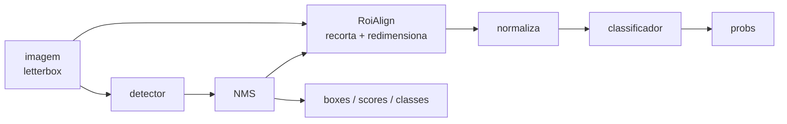

# Pipelines fundidos (detecção → classificação)

Você tem dois modelos. Um detector acha os objetos; um classificador diz de que
subtipo cada objeto é. O fluxo natural é encadear:

```python
detections = detector.predict("rebanho.jpg")[0]
for d in detections:
    sub = classifier.predict(d.cropped_image)[0]  # 😐 uma sessão a mais, uma volta a mais
```

Isso funciona — e custa caro. São **duas sessões**, **dois carregamentos de
modelo**, e uma ida e volta pelo Python (ou pelo JavaScript) para cada recorte:
fatiar, redimensionar, empilhar em batch, chamar o segundo runtime. No celular
ou numa aba de navegador, essa volta costuma dominar o tempo total.

O módulo `ort_vision_sdk.compose` remove as duas coisas. Ele reescreve os dois
`.onnx` num **único grafo**: o detector, uma ponte que recorta e redimensiona as
caixas, e o classificador. Um arquivo, uma sessão, um carregamento — e os
recortes nunca saem do runtime.



!!! info "Fundir é passo de build, rodar não é"
    A fusão precisa da biblioteca `onnx` (o extra `[compose]`), porque ela
    reescreve protobufs. O arquivo resultante é um `.onnx` comum: **rodar** não
    precisa de nada além do `onnxruntime` que o SDK já traz — inclusive no
    navegador, onde o SDK web carrega exatamente o mesmo arquivo.

## Instalando o extra

```bash
pip install "ort-vision-sdk[compose]"
```

## Fundindo os dois modelos

```python
from ort_vision_sdk.compose import fuse_detect_classify

fuse_detect_classify(
    "yolov8n.onnx",       # detector: cabeça YOLO anchor-free (v8..v26)
    "resnet18.onnx",      # classificador: uma entrada NCHW, uma saída (batch, classes)
    "pipeline.onnx",      # onde gravar o modelo fundido
    max_detections=20,    # quantas caixas o pipeline reporta por imagem
    conf_threshold=0.25,  # limiar de score, gravado dentro do NMS do grafo
    iou_threshold=0.45,   # limiar de IoU, idem
)
```

Pronto. `pipeline.onnx` é um modelo autocontido.

!!! check "A fusão se valida sozinha"
    Antes de retornar, `fuse_detect_classify` **roda o grafo fundido uma vez** no
    ONNX Runtime. Isso é o que pega o erro mais comum — um classificador cujo
    grafo só aceita o batch com que foi exportado (um `Reshape` com `1` fixo lá
    dentro). Você descobre na hora de fundir, não em produção. Passe
    `validate=False` para pular.

## Rodando

=== "Python"

    ```python
    from ort_vision_sdk import DetectClassify

    pipeline = DetectClassify("pipeline.onnx")
    result = pipeline.predict("rebanho.jpg")[0]

    for d in result:
        print(d.name, d.conf, d.box.xyxy)          # o que o detector achou
        print(d.classification.name, d.classification.conf)  # o que o classificador disse
    ```

=== "Web (browser)"

    ```typescript
    import { DetectClassify } from "@mauriciobenjamin700/ort-vision-sdk-web";

    const pipeline = await DetectClassify.create("/models/pipeline.onnx");
    const result = (await pipeline.predict("/images/rebanho.jpg"))[0];

    for (const d of result) {
      console.log(d.name, d.conf, d.box.xyxy);
      console.log(d.classification?.name, d.classification?.conf);
    }
    ```

Você não repetiu **nenhuma** configuração ao carregar. Resolução do letterbox,
tamanho do recorte, se a saída ainda precisa de softmax, os nomes das classes
dos dois estágios — tudo isso foi decidido na fusão e gravado nos metadados do
próprio arquivo. É a mesma ideia de [O modelo manda](modelo.md), levada ao
pipeline inteiro.

## Dois espaços de rótulo, separados

Um detector que acha `sheep` alimentando um classificador que responde
`famacha_3` não compartilha id de classe nenhum com ele. Por isso o envelope
carrega **dois** mapas, e a resposta do classificador mora no seu próprio campo:

```python
result.names             # {0: 'sheep', 1: 'goat'}       — estágio de detecção
result.classifier_names  # {0: 'famacha_1', 1: 'famacha_2', ...} — estágio de classificação

d = result[0]
d.cls, d.name              # classe do detector
d.classification.cls       # classe do classificador — outro espaço, outro id
```

!!! warning "Não compare `d.cls` com `d.classification.cls`"
    São perguntas diferentes: *que tipo de objeto é esse* e *de que subcategoria
    esse objeto é*. Juntar os dois num campo só perderia uma das respostas.

## Escolhendo de onde vêm os recortes

Esta é a decisão que mais muda o resultado.

=== "`detector_input` (padrão)"

    Recorta do próprio tensor 640×640 já letterboxado. O grafo tem **uma entrada
    só** e é o mais simples de operar.

    ```python
    fuse_detect_classify(det, clf, "pipeline.onnx", crop_source="detector_input")
    ```

    O custo: um objeto pequeno é classificado a partir da cópia reduzida. Uma
    caixa de 40×40 px dentro do letterbox de 640 vira um recorte de 224×224
    ampliado a partir de 40×40 pixels de detalhe real.

=== "`original`"

    Adiciona uma segunda entrada em resolução nativa. A ponte desfaz o letterbox
    **dentro do grafo** e recorta da imagem original.

    ```python
    fuse_detect_classify(det, clf, "pipeline.onnx", crop_source="original")
    ```

    São dois tensores para alimentar — mas o SDK monta os dois para você, e
    continua sendo **uma sessão e um carregamento**. Use esta opção quando o
    classificador depende de detalhe fino (textura, cor de mucosa, lesão
    pequena).

!!! tip "As caixas são idênticas nos dois modos"
    O grafo sempre reporta as caixas no espaço letterboxado do detector, e o
    runtime desfaz essa transformação do mesmo jeito nos dois casos. Trocar o
    `crop_source` muda a qualidade do recorte, nunca as coordenadas.

## Quantas caixas o pipeline reporta

Por padrão o pipeline tem um número **fixo** de linhas: `max_detections`. Sobras
são preenchidas com zeros, e a saída `num_detections` diz quantas são reais — o
runtime já ignora o resto para você.

```python
fuse_detect_classify(det, clf, "pipeline.onnx", max_detections=20)  # 20 linhas, sempre
```

Isso é o que mantém **todos os shapes do grafo estáticos**, e shapes estáticos
são o que TensorRT, NNAPI e WebGPU precisam para compilar o modelo. É também o
que elimina o caso de zero detecções: o classificador sempre recebe `K`
recortes, nunca um batch vazio que alguns providers se recusam a executar.

O preço é rodar o classificador `K` vezes mesmo quando há 2 objetos. Se isso
pesar mais que a compilação estática, use o modo dinâmico:

```python
fuse_detect_classify(det, clf, "pipeline.onnx", max_detections=None)
```

??? note "O que o modo dinâmico exige"
    O classificador precisa ter sido exportado com eixo de batch dinâmico, e
    precisa tolerar um batch de **zero** linhas (o que acontece quando nada passa
    do limiar). A validação da fusão testa exatamente esse caso, então você
    descobre na hora se o seu modelo não aguenta.

## Normalização do classificador

O recorte sai do grafo em `[0, 1]`. A ponte aplica a normalização do seu
classificador logo em seguida, com os mesmos parâmetros que a tarefa
`Classifier` usaria:

```python
fuse_detect_classify(
    det, clf, "pipeline.onnx",
    mean=(0.485, 0.456, 0.406),  # padrão: ImageNet
    std=(0.229, 0.224, 0.225),   # padrão: ImageNet
    input_scale=1.0,             # 255.0 se o seu modelo espera 0..255
)
```

Passos que seriam identidade (`mean` zero, `std` unitário, escala 1.0) não viram
nós — um classificador que quer o recorte cru em `[0, 1]` não paga aritmética
nenhuma.

## Limites que valem saber

- **A cabeça precisa ser YOLO anchor-free** — saída `(1, 4 + nc, N)`, a mesma
  família que o [`Detector`](deteccao.md) aceita. Cabeças com objectness
  explícito (v5/v6/v7) ou com NMS embutido (v10 *end2end*) são recusadas com uma
  mensagem clara em vez de lerem os canais errados em silêncio.
- **Os limiares ficam congelados no grafo.** `conf_threshold` e `iou_threshold`
  vão para dentro do nó de NMS. No runtime você pode filtrar **mais**
  (`predict(img, conf_threshold=0.6)`), nunca menos — para baixar o limiar, funda
  de novo.
- **O NMS fundido pontua todas as classes.** O decodificador Python colapsa cada
  âncora no seu `argmax` antes de suprimir; o `NonMaxSuppression` do ONNX avalia
  cada classe de forma independente. Uma âncora que passa do limiar em duas
  classes vira duas linhas aqui e uma linha lá.
- **Opsets são reconciliados para cima.** Se os dois modelos foram exportados em
  versões diferentes, o mais antigo é convertido — e o piso é o opset 16, exigido
  pelo `RoiAlign` da ponte.

## Recapitulando

- `fuse_detect_classify` transforma detector + classificador em **um** `.onnx`.
- Fundir precisa do extra `[compose]`; **rodar não precisa de nada a mais**.
- `DetectClassify` (Python e Web) carrega o arquivo e se configura sozinho a
  partir dos metadados gravados na fusão.
- `crop_source="original"` custa uma entrada a mais e devolve a resolução nativa
  ao classificador.
- `max_detections` fixo mantém os shapes estáticos; `None` troca isso por menos
  trabalho por execução.

## Próximos passos

- [Detecção](deteccao.md) — a cabeça que o estágio de detecção precisa ter.
- [Classificação](classificacao.md) — a normalização que o segundo estágio espera.
- [O modelo manda](modelo.md) — por que a configuração mora no arquivo.
- [API Python](../referencia/python.md) e [API Web](../referencia/web.md).
